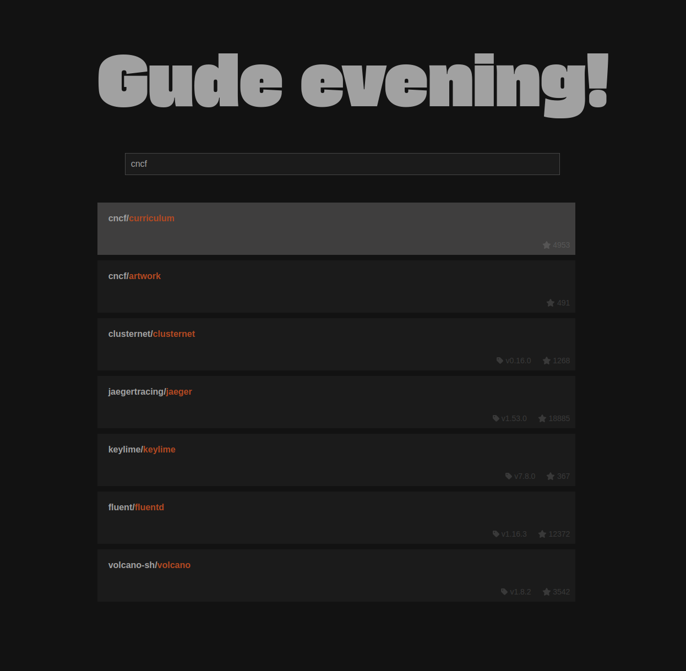

# gude-startpage

## Description

This project consists of two main parts: an importer written in Go and a web application written in JavaScript.

The importer fetches data from GitHub using the GitHub GraphQL API, specifically the starred repositories of a given user. It then indexes this data into a Meilisearch instance.

The web application serves as a user interface to interact with the data indexed by the importer.

The search will look for:

- repo user
- repo name
- repo description
- repo topics

Disclaimer. Everything you see here is a just for fun project to get into golang and react.

## Getting Started

### Prerequisites

- Docker

### Installation

1. Clone the repository
2. Install dependencies for the web application by navigating to the `web` directory and running `npm install`
3. Build the Docker images for the importer and the web application by running `docker-compose build`

### Usage

1. Start the services by running `docker-compose up`
2. Access the web application at `http://localhost:3000`
